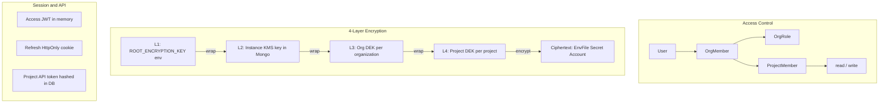
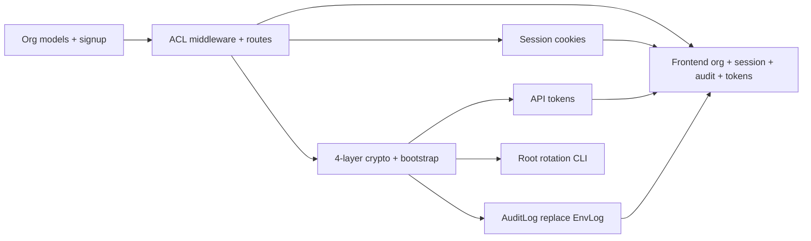

# HashEnv Security & Architecture Implementation Plan

**Status:** Historical — most items below are implemented. See [SETUP-AND-USAGE.md](./SETUP-AND-USAGE.md) for current behavior and [SECURITY-IMPROVEMENTS.md](./SECURITY-IMPROVEMENTS.md) for remaining gaps.

**Companion:** [SECURITY-IMPROVEMENTS.md](./SECURITY-IMPROVEMENTS.md)

---

## Greenfield Constraints

Pre-production. No important data. **No reverse compatibility required.**

| Removed from scope | Reason |
|--------------------|--------|
| `migrate-to-orgs.ts` | Signup creates personal org; dev DB can be wiped |
| `migrate-encryption.ts` | No flat `MASTER_ENCRYPTION_KEY` data to convert |
| Dual env var (`MASTER_*` + `ROOT_*`) | Single `ROOT_ENCRYPTION_KEY` only |
| `EnvLog` model | Delete; replace with `AuditLog` directly |
| Deprecated `User.role` / `requireAdmin` | Remove entirely, not shim |
| Dry-run / verify migration modes | N/A |
| `encryptionKeyVersion` on every record | Only on `InstanceKey` for root rotation |

**Dev reset:** `dropDatabase()` or fresh Mongo volume + re-register users is acceptable.

---

## Target Architecture



**Org policy:** auto-create **personal org** on signup; user may create/join **team orgs**; every project **must** pick an org.

---

## Workstream A — Organizations & Access Control

### A1. Data models (clean)

**New:**
- `backend/src/models/Organization.ts` — `{ name, slug, type: 'personal' | 'team', createdBy, createdAt }`
- `backend/src/models/OrgMember.ts` — `{ organizationId, userId, role: 'owner' | 'admin' | 'member' }`

**Update:**
- `backend/src/models/Project.ts` — required `organizationId`; keep `createdBy` + `members[]` (`read` | `write`)

**Remove:**
- `User.role` field and all JWT `role` claims
- `requireAdmin` middleware and frontend `AdminRoute` / `isAdmin`

### A2. Org roles vs project permissions

| Org role | Can do |
|----------|--------|
| **owner** | Delete team org, manage members, create/delete projects, org settings, org audit |
| **admin** | Manage members (not owner), create/delete projects, org audit |
| **member** | See org; **no** project access without project membership |

Project `read`/`write` gates all secrets/env/accounts. Org role never grants implicit project access.

### A3. Authorization middleware

Extend `backend/src/lib/authorization.ts`:

| Middleware | Purpose |
|------------|---------|
| `requireOrgMember()` | User in org |
| `requireOrgRole('admin')` | Org admin or owner |
| `requireOrgOwner()` | Org owner only |
| `requireProjectAccess()` | Org member AND (project owner OR collaborator with permission) |
| `requireProjectOwnership()` | Project owner + org member |

**Fix:** register `GET /users/search` **before** `GET /:id` in `projects.ts`.

User search: **org members only** via `GET /api/organizations/:orgId/members/search?q=`.

### A4. API routes

**New** `backend/src/routes/organizations.ts`:

| Method | Path | Auth |
|--------|------|------|
| GET | `/api/organizations` | Authenticated |
| POST | `/api/organizations` | Create team org; caller = owner |
| GET/PUT/DELETE | `/api/organizations/:orgId` | Member / admin+ / owner |
| GET/POST/PUT/DELETE | `/api/organizations/:orgId/members` | Member / admin+ |

**Update** `projects.ts`:
- `POST /api/projects` — require `organizationId`; caller org **admin+**
- `GET /api/projects?organizationId=` — filter by active org
- All routes verify org membership via project’s `organizationId`

### A5. Signup (no migration)

`backend/src/routes/auth.ts` on register:
1. Create user
2. Create personal org (`type: 'personal'`)
3. Create `OrgMember` with `role: 'owner'`

### A6. Access control fixes

| Issue | Fix |
|-------|-----|
| Write vs env edit inconsistency | **write** = upload + edit + delete env/secrets/accounts; **read** = view/download only |
| Global user search | Remove; org-scoped only |
| Members UI for non-owners | Hide unless project owner |

### A7. Frontend

- Org switcher (context + sidebar)
- Create project: required org picker
- Team org settings + members pages
- `organizationsAPI` in `frontend/lib/api.ts`

---

## Workstream B — 4-Layer Encryption

### B1. Crypto modules (replace `crypto.ts`)

| File | Role |
|------|------|
| `backend/src/crypto/primitives.ts` | AES-256-GCM; **12-byte nonce**; Buffer key in/out |
| `backend/src/crypto/key-store.ts` | Wrap/unwrap; in-memory instance key cache |
| `backend/src/crypto/bootstrap.ts` | Startup init |
| `backend/src/crypto/project-crypto.ts` | `encryptProjectData(projectId, plain)` / `decryptProjectData(...)` |

**Env:** `ROOT_ENCRYPTION_KEY` only (remove `MASTER_ENCRYPTION_KEY` from code and `env.example`).

### B2. Key models

| Model | When created | Wrapped by |
|-------|--------------|------------|
| `InstanceKey` (singleton) | First server boot, empty DB | Root key |
| `OrganizationEncryptionKey` | Org create | Instance key |
| `ProjectEncryptionKey` | Project create | Org DEK |

### B3. Bootstrap (Docker/restart safe)

On `index.ts` startup, before routes:

1. Read `ROOT_ENCRYPTION_KEY` — fail if missing/invalid
2. If no `InstanceKey` doc → generate + save (first boot)
3. If `InstanceKey` exists → unwrap with root key
4. If encrypted records exist but no `InstanceKey` → **fail fast** (clear error)
5. Expose `encryptionStatus` on `/api/health`

Restart with same Mongo volume + same root env = no key regeneration.

### B4. Hooks

| Event | Action |
|-------|--------|
| Org created | Create org DEK |
| Project created | Create project DEK |
| Project deleted | Delete project DEK |
| Org deleted | Block if projects exist; else delete org DEK |

### B5. Call sites

Wire `encryptProjectData` / `decryptProjectData` in:
- `routes/env.ts`
- `routes/secrets.ts`
- `routes/associatedAccounts.ts`
- `routes/settings.ts` (panic)

Delete old `encryptEnv`/`decryptEnv` global master API.

---

## Workstream C — Root Key Rotation

`backend/scripts/rotate-root-key.ts`:
1. Unwrap `InstanceKey` with current `ROOT_ENCRYPTION_KEY`
2. Re-wrap with new key
3. Bump `InstanceKey.keyVersion`
4. Operator updates env + restarts

Org DEKs, project DEKs, and all ciphertext **unchanged**.

No maintenance mode required for v1.

---

## Workstream D — Audit Logging

**Delete:** `EnvLog.ts`, `logging.ts` (`logEnvAction`).

**New:** `AuditLog.ts` + `lib/audit.ts`

```ts
{
  organizationId?, projectId?,
  resourceType: 'env' | 'secret' | 'account' | 'project' | 'org' | 'member' | 'session' | 'api_token' | 'panic',
  resourceId?, action,
  actorType: 'user' | 'api_token',
  actorId, actorEmail?,
  ipAddress, userAgent,
  metadata, createdAt
}
```

Log all sensitive actions (see prior plan list). No legacy env-log routes — replace with `/audit`.

**API:**
- `GET /api/organizations/:orgId/audit` — org admin+
- `GET /api/projects/:projectId/audit` — project owner or org admin+

**Frontend:** Replace logs page with new audit UI + filters + CSV export.

---

## Workstream E — Session Security

**New:** `RefreshToken.ts`

| Token | Storage | TTL |
|-------|---------|-----|
| Access JWT | React state only | 15 min |
| Refresh | HttpOnly `Secure` `SameSite=Strict` cookie | 7 days |

**Routes:** `POST /auth/refresh`, update login/logout.

**Frontend:** `withCredentials: true`; remove all `localStorage` token/user; boot via refresh.

---

## Workstream F — API Security

**New:** `ProjectApiToken.ts` — `hse_` prefix, SHA-256 hash, scopes, expiry.

**Scopes:** `env:read`, `env:write`, `secrets:read`, `secrets:write`, `accounts:read`

**Middleware:** `authenticate` accepts user JWT or project API token; attach scopes.

**Routes:** token CRUD under project (owner only).

**Rate limits:** `decryptRateLimiter` on content/credentials endpoints; per-token API limiter.

---

## Implementation Order

Single pass, backend-first:



| Step | Workstream | Output |
|------|------------|--------|
| 1 | A | Orgs, projects require orgId, signup flow, ACL |
| 2 | B | Crypto hierarchy, all encrypt paths updated |
| 3 | D | AuditLog wired everywhere |
| 4 | E | HttpOnly sessions |
| 5 | F | API tokens + rate limits |
| 6 | C | Root rotation script |
| 7 | A+D+E+F | Frontend |

---

## Testing

| Area | Test |
|------|------|
| Crypto | Unit wrap chain; bootstrap first boot vs restart |
| ACL | Org member blocked without project membership |
| Session | No localStorage; refresh + logout revoke |
| API tokens | Scope + revoke enforcement |
| Rotation | Re-wrap instance key; decrypt still works |

No migration tests.

---

## Files Summary

**Delete:** `EnvLog.ts`, `lib/logging.ts`, deprecated admin code, `MASTER_ENCRYPTION_KEY` references

**New:** Organization, OrgMember, InstanceKey, OrganizationEncryptionKey, ProjectEncryptionKey, AuditLog, RefreshToken, ProjectApiToken, `crypto/*`, `routes/organizations.ts`, `lib/audit.ts`, `scripts/rotate-root-key.ts`

**Major edit:** Project, User, authorization, auth, index, projects, env, secrets, associatedAccounts, settings, security, env.example, frontend auth/api/UI

---

## Out of Scope

- External KMS / HSM
- MFA / TOTP
- SSO / SAML
- Client-side E2EE
- Data migration / backward compatibility
