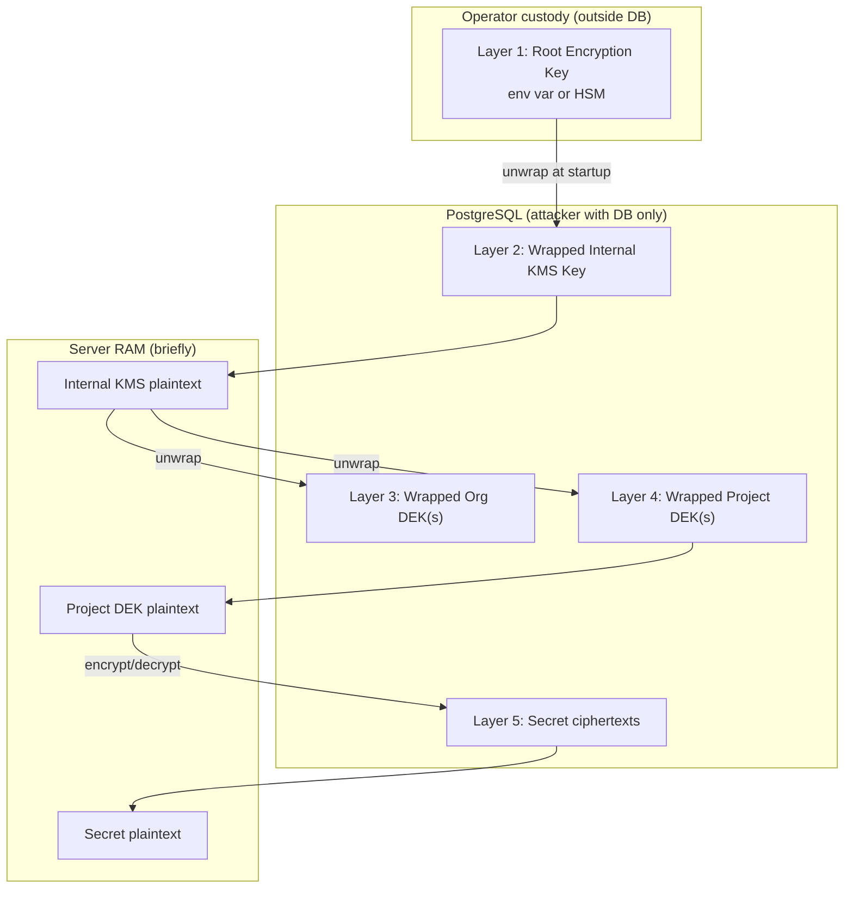
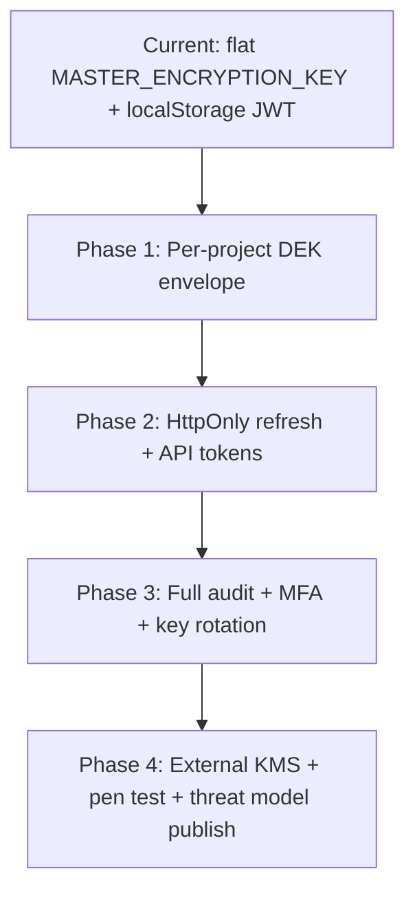

# HashEnv Security Improvements

**Document purpose:** Compare Infisical's security and encryption model against HashEnv's current implementation, and define prioritized improvements.

**Last updated:** June 2026  
**Status:** Planning / not yet implemented

---

## Executive Summary

HashEnv uses the correct cryptographic primitive (**AES-256-GCM**) with per-record random IVs and authenticated decryption. The largest gaps versus industry practice (as embodied by [Infisical's security model](https://infisical.com/docs/internals/security)) are architectural:

1. **Single global encryption key** — one `MASTER_ENCRYPTION_KEY` protects all projects, secrets, env files, and associated accounts.
2. **Session security** — JWT stored in browser `localStorage` (XSS-sensitive) with a 7-day lifetime.
3. **Incomplete audit trail** — env file actions are logged; secrets, associated accounts, panic events, and request metadata (IP, user-agent) are not fully covered.
4. **No machine/API token model** — CI/CD must reuse long-lived user JWTs.
5. **No key rotation path** — a leaked master key is a permanent breach.

Infisical's **current** model (new projects, 2023+) is **server-side encryption at rest** with a **hierarchical key envelope** — not client-side zero-knowledge E2EE. HashEnv should target parity with that model, not legacy Infisical E2EE.

---

## Part 1: Infisical Security & Encryption Analysis

Sources: [Infisical Security docs](https://infisical.com/docs/internals/security), [Project upgrade (E2EE deprecation)](https://infisical.com/docs/documentation/platform/project-upgrade), [KMS overview](https://infisical.com/docs/documentation/platform/kms/overview).

### 1.1 Threat Model

Infisical explicitly documents what it defends against and what it does not.

**In scope (defended):**

| Threat | Mitigation |
|--------|------------|
| Eavesdropping in transit | TLS 1.2+ (Cloudflare on Infisical Cloud) |
| Tampering at rest / in transit | AES-256-GCM + auth tag verification; abort on failure |
| Unauthorized access | Auth on every request; MFA; RBAC / ABAC at org + project level |
| Actions without accountability | Audit logs with actor, IP, user-agent, timestamp, metadata |
| DB confidentiality breach | Hierarchical encryption — DB alone insufficient to decrypt |
| Suspicious activity | Monitoring for anomalous auth (e.g. unseen sources) |
| Unknown vulnerabilities | Biannual third-party penetration tests |

**Out of scope (acknowledged limits):**

- Uncontrolled full access to the storage backend
- Disclosure of secret *existence* (metadata visible if DB is readable)
- Runtime memory intrusion on a live server
- Compromised client machines / leaked client credentials
- Admin configuration tampering
- Physical infrastructure access
- Social engineering

### 1.2 Cryptography

**Algorithm:** AES-256-GCM with **96-bit (12-byte) random nonces** per encryption operation.

**Architecture:** Four-layer hierarchical envelope encryption:

```
ROOT_ENCRYPTION_KEY (operator env var, 256-bit AES)
    └── Internal KMS Root Key (generated on first boot, stored encrypted in DB)
            ├── Organization Data Key (one per org)
            └── Project Data Key (one per project)
                    └── Secrets, certs, credentials, env data
```

**Properties:**

- Root key never leaves server memory during operation.
- Root key only wraps the Internal KMS Root Key (limited exposure surface).
- Per-tenant data keys provide **cryptographic isolation** between orgs/projects.
- Optional **external KMS** (AWS KMS, GCP KMS, HSM) can unwrap project keys — root of trust shifts to customer cloud account.
- Optional **FIPS 140-3** mode (enterprise).

**Store flow:**

1. Retrieve encrypted data key from DB.
2. Unwrap data key using Internal KMS Root Key (or external KMS).
3. Encrypt plaintext with data key + random nonce.
4. Persist ciphertext + nonce + auth tag.

**Retrieve flow:** Reverse with GCM tag verification before returning plaintext.

### 1.2.1 Key Lifecycle — How Each Layer Is Created, Stored, and Custodied

This section answers five questions for every layer in Infisical's hierarchy: **how** the key is created, **when**, **by whom**, **where** it is stored, and **how** it is stored (format/wrapping).

> **Terminology:** *Wrap* = encrypt a key with another key. *Unwrap* = decrypt a wrapped key to use it in memory. Plaintext keys exist only briefly in server RAM during crypto operations.

---

#### Layer 1 — Root Encryption Key

| Question | Answer |
|----------|--------|
| **What is it?** | 256-bit AES symmetric key. Top of the trust chain for the whole instance. |
| **How created?** | **Not** generated by Infisical. Operator creates it offline with a CSPRNG, e.g. `openssl rand -base64 32` or `node -e "console.log(require('crypto').randomBytes(32).toString('base64'))"`. |
| **When created?** | **Before** first deployment. Must be present in the environment when the instance starts. If missing, the server cannot unwrap the Internal KMS Root Key and cannot decrypt any data. |
| **By whom?** | **Infrastructure operator** — self-host customer, DevOps, or (on Infisical Cloud) Infisical platform team provisioning the managed instance. |
| **Stored where?** | **Outside the database.** Runtime: process environment variable (`ENCRYPTION_KEY` / `ROOT_ENCRYPTION_KEY`). At rest (deploy time): secret manager, K8s Secret, Docker env file on host, CI/CD vault — wherever the operator keeps infra secrets. |
| **Stored how?** | **Plaintext in env** at runtime (loaded into server memory only). Docs state it **never leaves server memory** during normal operation — it is not written to Postgres. On disk it lives only in the operator's secret-delivery mechanism (env file, vault injection). **Not** encrypted by another Infisical key (there is no layer above it in software mode). |

**HSM alternative (enterprise):** Root trust moves to a hardware device. Infisical creates or uses an AES-256 key **inside the HSM** (PKCS#11, label from `HSM_KEY_LABEL`). The root key material **never exists as a software env var** — the HSM performs wrap/unwrap. Stored on the HSM token (`CKA_TOKEN: true`). See [HSM integration](https://infisical.com/docs/documentation/platform/kms/hsm-integration).

---

#### Layer 2 — Internal KMS Root Key

| Question | Answer |
|----------|--------|
| **What is it?** | 256-bit AES symmetric key. Intermediate "master" that wraps all org/project data keys. |
| **How created?** | `crypto.randomBytes(32)` (Node.js CSPRNG). Cryptographically random; Infisical does not derive it from passwords or user input. |
| **When created?** | **Once**, on the **first startup** of a new Infisical instance (first boot after install). Not recreated on restart — persisted in DB. |
| **By whom?** | **Infisical server process** automatically during instance initialization. No human action. |
| **Stored where?** | **PostgreSQL** (Infisical's storage backend). |
| **Stored how?** | **Wrapped (encrypted) at rest** using Layer 1 (Root Encryption Key). DB holds only: ciphertext + nonce + auth tag (AES-256-GCM envelope). Plaintext Internal KMS key exists only in RAM when the server unwraps it at startup or during crypto ops. **DB dump alone cannot decrypt this key** without also having the Root Encryption Key from the environment. |

**Why this layer exists:** Root key is used only to protect this one key, reducing how often the root is used in crypto code paths. Rotating or compartmentalizing tenant keys does not require changing the root env var as often.

---

#### Layer 3 — Organization Data Key

| Question | Answer |
|----------|--------|
| **What is it?** | 256-bit AES **data encryption key (DEK)** dedicated to one organization. |
| **How created?** | `crypto.randomBytes(32)` via Node.js crypto. |
| **When created?** | When a **new organization** is created in the platform (signup / org provisioning). |
| **By whom?** | **Infisical server** (internal KMS service). Triggered by org-creation API/flow. |
| **Stored where?** | **PostgreSQL**, in org/KMS-related tables (encrypted key record per org). |
| **Stored how?** | **Wrapped** with the **Internal KMS Root Key** (Layer 2). DB stores encrypted DEK + nonce + auth tag. Plaintext org DEK only in server RAM during encrypt/decrypt of org-level data (SSO config, SCIM, machine identity metadata, org integrations). |

**Protects:** Organization-level sensitive config — SAML/SSO settings, SCIM, machine identities, org-wide integration credentials.

---

#### Layer 4 — Project Data Key

| Question | Answer |
|----------|--------|
| **What is it?** | 256-bit AES DEK dedicated to one project (vault). |
| **How created?** | `crypto.randomBytes(32)` via Node.js crypto. |
| **When created?** | When a **new project** is created, or when KMS is configured for an existing project. |
| **By whom?** | **Infisical server** (KMS service). Can be auto on project create or admin-configured. |
| **Stored where?** | **PostgreSQL**, per-project KMS/key record. |
| **Stored how (default)** | **Wrapped** with **Internal KMS Root Key** (Layer 2) — same pattern as org keys. Ciphertext + nonce + auth tag in DB. |
| **Stored how (external KMS)** | Project DEK is wrapped by **AWS KMS**, **GCP KMS**, or similar instead of the internal KMS root. Encrypted DEK blob in DB; **unwrap** calls go to the external KMS API. Root of trust = customer's cloud KMS key policy. See [KMS configuration](https://infisical.com/docs/documentation/platform/kms-configuration/overview). |

**Protects:** Project secrets, env values, certificates, private keys, DB connection strings, API tokens stored in the vault.

**Cryptographic isolation:** Project A's DEK cannot decrypt Project B's ciphertext even if an attacker reads the whole database.

---

#### Layer 5 — Per-Secret / Per-Record Encryption (Data at Rest)

This is not a long-lived "key layer" but the **data encryption step** using Layer 4.

| Question | Answer |
|----------|--------|
| **What is it?** | AES-256-GCM encryption of the actual secret value or blob. |
| **How created?** | Random **96-bit (12-byte) nonce** per encrypt operation (`crypto.randomBytes(12)`). No persistent per-secret key — reuses the project DEK. |
| **When created?** | Every **create** or **update** of a secret, certificate, credential, etc. New nonce each time. |
| **By whom?** | **Infisical server** on write path after authZ check. Client sends plaintext over TLS; server encrypts before persist (current/non-E2EE model). |
| **Stored where?** | **PostgreSQL** — secrets / versions tables. |
| **Stored how?** | Three fields (conceptually): `ciphertext` + `nonce` + `authentication_tag`. Encrypted under the **plaintext project DEK** (Layer 4, unwrapped in memory). GCM tag prevents tampering. |

**Read path:** Unwrap project DEK → load ciphertext + nonce + tag → decrypt in memory → return plaintext over TLS to authorized client.

---

#### Summary Table (Infisical — Current Server-Side Model)

| Layer | Key material | Created when | Created by | Stored where | Stored how |
|-------|--------------|--------------|------------|--------------|------------|
| **1. Root** | 256-bit AES | Pre-deploy | Operator (human) | Env / secret manager / HSM | Plaintext in runtime env, or key on HSM |
| **2. Internal KMS** | 256-bit AES | First instance boot | Server (auto) | PostgreSQL | Wrapped by Layer 1 |
| **3. Org DEK** | 256-bit AES | Org creation | Server (auto) | PostgreSQL | Wrapped by Layer 2 |
| **4. Project DEK** | 256-bit AES | Project creation | Server (auto) | PostgreSQL | Wrapped by Layer 2 or external KMS |
| **5. Secret blob** | (uses Layer 4) | Each secret write | Server (auto) | PostgreSQL | AES-GCM ciphertext + nonce + tag |

#### Custody Diagram



**To decrypt everything an attacker needs:** PostgreSQL dump **+** Root Encryption Key (or HSM access) **+** a running server or equivalent unwrap implementation. DB alone is insufficient.

---

#### Legacy E2EE Path (Old Projects Only — Not Default)

For **legacy** Infisical projects (pre–project-upgrade), an additional client-side model existed:

| Item | How | When | By whom | Stored where | Stored how |
|------|-----|------|---------|--------------|------------|
| User key pair | x25519 generated in browser | User signup | Client (browser) | Private key: client only; public key: server DB | Password-derived encryption of private key |
| Project key | Random symmetric key | Project create | Client | Server DB | Encrypted under each member's **public** key |
| Secrets | AES encrypt | Secret write | Client | Server DB | Encrypted under project key before upload |

Server could store but **not decrypt** without a member's private key — true zero-knowledge. **New projects (V3+) do not use this.** HashEnv should not implement this unless explicitly targeting that niche.

---

#### HashEnv Today vs Recommended (For Comparison)

| Layer | HashEnv **today** | HashEnv **recommended** (from Part 4) |
|-------|-------------------|--------------------------------------|
| Root | `MASTER_ENCRYPTION_KEY` in env; operator-generated | Rename to `ROOT_ENCRYPTION_KEY`; same pattern; document self-host custody |
| Instance KMS | **Missing** — master key encrypts data directly | Auto-generated on first boot; wrapped by root; stored in MongoDB |
| Org DEK | **N/A** (no org entity) | Optional later if multi-org added |
| Project DEK | **Missing** | Generated on `Project.create`; wrapped by instance KMS; stored in MongoDB |
| Secret blob | AES-256-GCM under **global** master key | AES-256-GCM under **project DEK**; 12-byte nonce |

| Question | HashEnv today |
|----------|---------------|
| **How is master key created?** | Operator runs `crypto.randomBytes(32).toString('base64')`; set in `backend/.env`. |
| **When?** | Before first server start. `getMasterKey()` throws if unset. |
| **By whom?** | Deployer / developer. |
| **Stored where?** | `MASTER_ENCRYPTION_KEY` env var; also in `backend/.env` on disk (risk if committed). |
| **Stored how?** | Plaintext in environment. Used directly in `encryptEnv()` / `decryptEnv()` — no wrapping layer. |
| **Per-record** | Random 16-byte IV per `encryptEnv` call; ciphertext + iv + authTag in MongoDB (`EnvFile`, `Secret`, `AssociatedAccount`). |

---

### 1.3 End-to-End Encryption (E2EE) — Historical Note

Infisical originally supported client-side zero-knowledge encryption (project keys encrypted under user public keys, SRP auth). As of the [project upgrade initiative](https://infisical.com/docs/documentation/platform/project-upgrade):

- **New projects (V3+)** have E2EE **disabled by default**.
- Rationale: API/CI usability, project continuity when creator leaves, reduced client-side crypto complexity.
- Legacy projects retain E2EE for backward compatibility.
- PR [#4270](https://github.com/Infisical/infisical/pull/4270) removed SRP and frontend private keys for new users.

**Implication for HashEnv:** Industry direction favors **server-side encrypt-at-rest + strong key hierarchy** over client-side E2EE for team secrets managers. Do not prioritize zero-knowledge unless targeting a specific niche (e.g. dotenvx-style encrypt-in-git).

### 1.4 Authentication & Tokens

| Feature | Infisical |
|---------|-----------|
| Human auth | Username/password, SAML, SSO, LDAP, OIDC, K8s, cloud native |
| Web session | Short-lived JWT in **browser memory**; refresh token in **HttpOnly cookie** |
| Machine access | Machine identities with scoped tokens |
| Token controls | Custom TTL, IP restrictions, usage caps |
| MFA | TOTP supported |

### 1.5 Authorization

- Organization and project namespaces.
- RBAC + attribute-based access + additional per-resource privileges.
- Groups with role assignments.

### 1.6 Audit & Operations

- All secret mutations and policy changes logged.
- Actor identity, IP, user-agent, timestamp on events.
- Configurable rate limits per operation type (read, write, secrets).
- Strict Content-Security-Policy on web UI.
- Biannual external pen tests (Cure53 cited in docs).

### 1.7 Self-Host vs Cloud Trust

| Deployment | Who holds root key | Who can decrypt |
|------------|-------------------|-----------------|
| Self-hosted | Customer (operator) | Customer controls instance + DB + `ROOT_ENCRYPTION_KEY` |
| Infisical Cloud | Infisical operations | Infisical ops with infrastructure access; legacy zero-knowledge projects limit employee visibility |

---

## Part 2: HashEnv Current Security Posture

Based on codebase review (`backend/src/lib/crypto.ts`, `auth.ts`, `authorization.ts`, `middleware/security.ts`, models, routes).

### 2.1 What HashEnv Does Well

| Area | Implementation |
|------|----------------|
| Cipher | AES-256-GCM with random IV per record |
| Integrity | Auth tag validated on decrypt; generic error on failure |
| Password hashing | bcrypt, 12 rounds |
| JWT secret | Required, minimum 32 characters, no default fallback |
| Email gate | Unverified users blocked from protected routes |
| Project RBAC | Owner (write) + collaborators (read/write) |
| Input validation | ObjectId format checks, express-validator, upload size limits |
| Rate limiting | Auth (5/15min), API (100/15min), uploads (50/hr) |
| HTTP hardening | Helmet, CSP, HSTS |
| Error sanitization | Generic messages in production |
| Secure logging utility | Redacts sensitive key names in logs |
| Env audit log | `EnvLog` model tracks upload/download/edit/delete/access |
| Incident response | Panic button, auto-flush, collaborator revoke (differentiator) |
| Credential metadata | Associated accounts exclude ciphertext from list endpoints |

### 2.2 Current Encryption Model

```
MASTER_ENCRYPTION_KEY (single env var)
    └── All EnvFile, Secret, AssociatedAccount blobs (flat)
```

**Files involved:**

- `backend/src/lib/crypto.ts` — `encryptEnv` / `decryptEnv`
- `backend/src/models/EnvFile.ts`
- `backend/src/models/Secret.ts`
- `backend/src/models/AssociatedAccount.ts`

**Gap:** No per-project data encryption keys. One compromised master key decrypts all tenant data.

### 2.3 Authentication Gaps

| Issue | Location | Risk |
|-------|----------|------|
| JWT in `localStorage` | `frontend/contexts/AuthContext.tsx`, `frontend/lib/api.ts` | XSS → full account takeover |
| 7-day JWT expiry | `JWT_EXPIRES_IN=7d` in `backend/env.example` | Long window if token stolen |
| No refresh token rotation | — | Cannot revoke sessions server-side |
| No MFA | `User` model | Weak for secrets product |
| No machine/API tokens | API uses user JWT only | CI/CD anti-pattern |
| Default `role: 'admin'` | `backend/src/models/User.ts` (deprecated field) | Misleading / risky if referenced |

### 2.4 Audit Gaps

`EnvLog` captures action, user, environment, version — but **missing:**

- IP address and user-agent
- Secret CRUD / decrypt events
- Associated account credential access
- Panic button activation and outcomes
- Failed authentication attempts
- Append-only / tamper-evident guarantees

### 2.5 Operational Gaps

- No key rotation mechanism
- No external KMS integration
- No published threat model for customers
- No third-party security assessment process documented
- IV length 16 bytes (valid; Infisical standardizes on 12-byte nonces per NIST SP 800-38D)

---

## Part 3: Gap Analysis Matrix

| Capability | Infisical (current) | HashEnv (today) | Priority |
|------------|---------------------|-----------------|----------|
| AES-256-GCM | Yes | Yes | — |
| Hierarchical key envelope | Yes (4 layers) | No (1 layer) | **P0** |
| Per-project crypto isolation | Yes | No | **P0** |
| External KMS | Yes | No | P2 |
| Key rotation | Yes | No | P1 |
| HttpOnly refresh tokens | Yes | No | **P0** |
| Machine/API tokens | Yes | No | **P0** |
| MFA (TOTP) | Yes | No | P1 |
| Full audit (IP, UA, all resources) | Yes | Partial | **P0** |
| RBAC depth | Org + project + ABAC | Project read/write | P1 |
| Rate limiting | Per operation type | Global API + auth | P2 |
| Published threat model | Yes | No | P1 |
| Pen test program | Yes (biannual) | No | P2 |
| Client-side E2EE | Deprecated | N/A | Skip |
| Panic / incident response | Limited | Yes (strength) | Maintain |

---

## Part 4: Recommended Improvements

### P0 — Before production / paid launch

#### 4.1 Hierarchical Envelope Encryption

**Goal:** DB-only compromise must not expose all plaintext secrets.

**Target architecture:**

```
ROOT_ENCRYPTION_KEY (env — operator-provided on self-host)
    └── Instance KMS Key (generated once, stored encrypted in DB)
            └── Per-Project DEK (data encryption key, stored encrypted)
                    └── EnvFile, Secret, AssociatedAccount ciphertext
```

**Implementation checklist:**

- [ ] Add `InstanceKey` document (encrypted KMS key blob + iv + authTag).
- [ ] Add `ProjectEncryptionKey` document per project (encrypted DEK + `keyVersion`).
- [ ] Refactor `encryptEnv` / `decryptEnv` to accept a project DEK, not global master.
- [ ] Generate DEK on project creation; re-wrap on key rotation.
- [ ] Migration script: decrypt with old master, re-encrypt with per-project DEKs.
- [ ] Document self-host setup: customer generates `ROOT_ENCRYPTION_KEY`, never shares with HashEnv SaaS operator.

**Reference:** [Infisical key hierarchy](https://infisical.com/docs/internals/security#key-hierarchy)

#### 4.2 Secure Session Management

**Goal:** Eliminate XSS token theft via `localStorage`.

**Implementation checklist:**

- [ ] Short-lived access JWT (15–60 minutes) — memory only on frontend.
- [ ] Refresh token in `HttpOnly`, `Secure`, `SameSite=Strict` cookie.
- [ ] Server-side refresh token store with revocation on logout.
- [ ] Rotate refresh token on each use (optional but recommended).
- [ ] Remove `localStorage.setItem('token', ...)`.

**Reference:** [Infisical external threat overview — browser token storage](https://infisical.com/docs/internals/security#external-threat-overview)

#### 4.3 Project-Scoped API Tokens

**Goal:** CI/CD and automation without user session JWTs.

**Implementation checklist:**

- [ ] `ProjectApiToken` model: `name`, `projectId`, `scopes[]`, `hashedToken`, `expiresAt`, `lastUsedAt`, `createdBy`.
- [ ] Scopes: e.g. `env:read`, `env:write`, `secrets:read`, `accounts:read`.
- [ ] Show token once on creation; store bcrypt/SHA-256 hash only.
- [ ] Optional IP allowlist per token.
- [ ] Dedicated auth middleware for `Authorization: Bearer <api-token>`.
- [ ] Audit every API token usage.

**Reference:** [Infisical machine identities](https://infisical.com/docs/internals/security#external-threat-overview)

#### 4.4 Comprehensive Audit Logging

**Goal:** Every sensitive action traceable to actor and source.

**Implementation checklist:**

- [ ] Extend `EnvLog` → generic `AuditLog` with `resourceType`, `resourceId`, `action`, `metadata`.
- [ ] Log: secret create/read/update/delete, account credential decrypt, panic trigger, member add/remove, API token use, login success/failure.
- [ ] Capture `ip`, `userAgent`, `actorId`, `actorType` (user | api-token).
- [ ] UI: project audit log view with filters.
- [ ] Prevent user deletion of audit records.

**Reference:** [Infisical threat model — accountability](https://infisical.com/docs/internals/security#threat-model)

---

### P1 — Strong security posture (next quarter)

#### 4.5 Key Rotation

- [ ] `keyVersion` field on encrypted records.
- [ ] CLI/admin endpoint: `rotate-root-key` and `rotate-project-dek`.
- [ ] Document backup-before-rotate procedure.
- [ ] Support decrypting old versions during migration window.

#### 4.6 Multi-Factor Authentication (TOTP)

- [ ] `User.totpSecret` (encrypted), `totpEnabled`, backup codes.
- [ ] Require MFA for panic button and associated account credential reveal (step-up auth).
- [ ] Optional org-wide MFA enforcement (future).

#### 4.7 Align GCM Nonce Size

- [ ] Change `IV_LENGTH` from 16 to 12 bytes in `crypto.ts` for NIST SP 800-38D alignment.
- [ ] Migration: existing 16-byte IV records remain supported on decrypt.

#### 4.8 Published Threat Model

- [ ] Add `docs/THREAT-MODEL.md` mirroring Infisical's in/out-of-scope structure.
- [ ] State explicitly: SaaS operator holds root key; self-host customer holds root key.
- [ ] Link from landing page security section.

#### 4.9 Fix User Role Default

- [ ] Change `User.role` default from `'admin'` to `'user'` in `backend/src/models/User.ts`.
- [ ] Remove or fully deprecate role field if unused.

#### 4.10 Associated Account Hardening

- [ ] Mandatory audit on `GET .../accounts/:id/credentials` (decrypt endpoint).
- [ ] Optional password re-entry before credential reveal.
- [ ] Rate limit credential decrypt separately (stricter than general API).

---

### P2 — Enterprise / self-host readiness

#### 4.11 External KMS Integration

- [ ] Support `AWS_KMS_KEY_ARN` or `GCP_KMS_KEY_ID` as alternative to env-based root key.
- [ ] Unwrap instance/project DEKs via KMS API.
- [ ] Document for regulated customers.

**Reference:** [Infisical external KMS](https://infisical.com/docs/internals/security#external-kms-integration)

#### 4.12 Granular Rate Limiting

- [ ] Separate limits for: auth, secret read, secret write, decrypt, upload.
- [ ] Align with Infisical's per-operation throttling.

#### 4.13 Security Assessment Program

- [ ] Annual third-party penetration test before enterprise sales.
- [ ] Dependency scanning in CI (npm audit, Snyk/Dependabot).
- [ ] Publish summary or attestation letter for customers.

#### 4.14 Infrastructure Hardening (SaaS)

- [ ] MongoDB TLS enforced in production (partially present in `index.ts`).
- [ ] Secrets manager for `MASTER_ENCRYPTION_KEY` / `JWT_SECRET` (not plain `.env` on host).
- [ ] WAF / DDoS protection on public endpoints.

---

### Explicitly Out of Scope (for now)

| Item | Reason |
|------|--------|
| Client-side zero-knowledge E2EE | Infisical deprecated for new projects; hurts API/CI UX |
| Dynamic secrets / PKI | Product scope creep; Vault/Infisical territory |
| FIPS 140-3 mode | Enterprise-only; defer until customer demand |
| Full ABAC / org hierarchy | Defer until multi-org customers exist |

---

## Part 5: Implementation Roadmap



| Phase | Deliverables | Est. effort |
|-------|--------------|-------------|
| **1** | Instance KMS key + per-project DEK, crypto refactor, migration | Medium–High |
| **2** | Cookie-based sessions, project API tokens | Medium |
| **3** | Audit expansion, TOTP MFA, key rotation CLI | Medium |
| **4** | External KMS, security docs, pen test | High |

**Minimum viable security story (matches Infisical current model):**

> Per-project encrypted data keys wrapped by an instance key wrapped by an operator-controlled root key. Short-lived sessions. Scoped API tokens. Full audit trail.

---

## Part 6: HashEnv Differentiators to Preserve

While closing gaps, maintain features Infisical does not emphasize:

- **Panic button** — flush envs, revoke collaborators, emergency export.
- **Auto-flush policies** — time-based credential expiry.
- **Associated accounts** — third-party service credentials alongside env files.

Ensure these flows are covered by the new audit and encryption models.

---

## References

| Resource | URL |
|----------|-----|
| Infisical Security (official) | https://infisical.com/docs/internals/security |
| Infisical Project Upgrade (E2EE deprecation) | https://infisical.com/docs/documentation/platform/project-upgrade |
| Infisical KMS Overview | https://infisical.com/docs/documentation/platform/kms/overview |
| Infisical KMS Configuration | https://infisical.com/docs/documentation/platform/kms-configuration/overview |
| Infisical SRP removal PR | https://github.com/Infisical/infisical/pull/4270 |
| NIST SP 800-38D (GCM nonces) | https://csrc.nist.gov/publications/detail/sp/800-38d/final |
| OWASP Session Management | https://cheatsheetseries.owasp.org/cheatsheets/Session_Management_Cheat_Sheet.html |
| OWASP JWT Security | https://cheatsheetseries.owasp.org/cheatsheets/JSON_Web_Token_for_Java_Cheat_Sheet.html |

---

## Appendix: File Map (HashEnv security-related code)

| File | Responsibility |
|------|----------------|
| `backend/src/lib/crypto.ts` | AES-256-GCM encrypt/decrypt |
| `backend/src/lib/auth.ts` | JWT, bcrypt, authenticate middleware |
| `backend/src/lib/authorization.ts` | Project RBAC |
| `backend/src/middleware/security.ts` | Rate limits, Helmet, error sanitization |
| `backend/src/lib/logging.ts` | Env action audit |
| `backend/src/models/EnvLog.ts` | Audit log schema |
| `backend/src/routes/env.ts` | Env file upload/download |
| `backend/src/routes/secrets.ts` | Individual secrets |
| `backend/src/routes/associatedAccounts.ts` | Third-party account credentials |
| `backend/src/routes/settings.ts` | Panic button, flush policies |
| `frontend/contexts/AuthContext.tsx` | Client session (`localStorage`) |
| `backend/env.example` | `MASTER_ENCRYPTION_KEY`, `JWT_SECRET` config |
